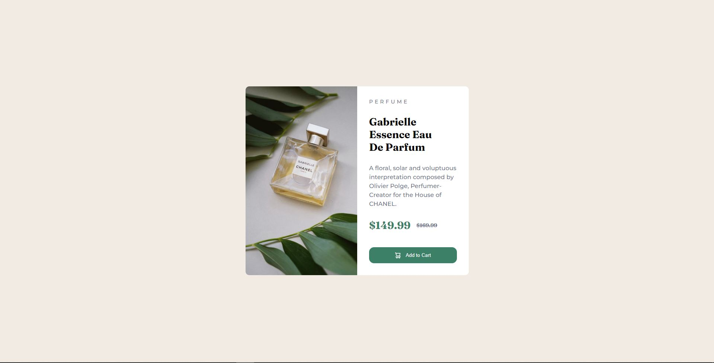

# Frontend Mentor - Product preview card component solution

This is a solution to the [Product preview card component challenge on Frontend Mentor](https://www.frontendmentor.io/challenges/product-preview-card-component-GO7UmttRfa). Frontend Mentor challenges help you improve your coding skills by building realistic projects. 

## Table of contents

- [Overview](#overview)
  - [The challenge](#the-challenge)
  - [Screenshot](#screenshot)
  - [Links](#links)
- [My process](#my-process)
  - [Built with](#built-with)
  - [What I learned](#what-i-learned)
  - [Continued development](#continued-development)
  - [Useful resources](#useful-resources)
- [Author](#author)
- [Acknowledgments](#acknowledgments)

**Note: Delete this note and update the table of contents based on what sections you keep.**

## Overview

### The challenge

Users should be able to:

- View the optimal layout depending on their device's screen size
- See hover and focus states for interactive elements

### Screenshot

### Links

- Live Site URL: [Add live site URL here](https://your-live-site-url.com)

## My process

I first created a container to hold my two sections, img and details, and applied flexbox to bring it in the middle of the page. Then applying CSS custom properties on the img 
and on the details page, I recreated the product purchase card given as a practice for HTML and CSS. The issue for me was the addition of media queries as I'm new to that. Took me a while and in order to change the sections to be on top of each other, I used the flex-direction column. 

### Built with

- Semantic HTML5 markup
- CSS custom properties
- Flexbox

### What I learned

I reinforced and practice more of the use of flexbox in my projects. Using HTML and CSS helps to hone in on the tricky side of CSS, flexbox etc. 

### Continued development

I need to keep on practice flexbox and the application of it. It took me a while to understand how some div's went togehter and took a while to center it. 

### Useful resources

- [Example resource 1](https://www.youtube.com/watch?v=fYq5PXgSsbE) - Web Dev Simplified really helped me understand the basics of flexbox. 
- [Example resource 2](hhttps://www.youtube.com/watch?v=5xzaGSYd7jM) - This helped me get the basic of media queries and a light understanding of it. 

## Author

- Website - [Edmond Wu]
- Frontend Mentor - [@Edmond-Wu-9](https://www.frontendmentor.io/profile/yourusername)
